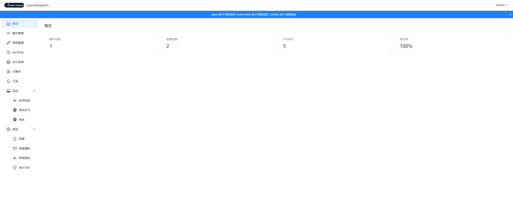

# openAssassin

开源刺客平台 — 管理员登录、管理脚本(Shell/Python)、引用密钥执行、查看日志，支持 TOTP 双因素认证。Docker Compose 一键部署。

## 快速开始

```bash
# 克隆仓库
git clone https://github.com/githubliuyang777/openassassin.git
cd openassassin

# 构建并部署（无缓存构建前后端镜像 + 自动拉起）
bash deploy.sh

# 或直接拉取已有镜像启动
docker compose up -d

# 访问前端
open http://localhost:8080
```

**默认账号**: `admin` / `admin`

> 首次登录后建议立即修改密码。如忘记密码，可使用登录页的「忘记密码」功能（需配置 SMTP）。

## 界面预览



## 功能概览

| 模块 | 功能 |
|------|------|
| 概览 | 仪表盘首页 |
| 脚本管理 | 创建/编辑/删除 Shell 和 Python 脚本 |
| 脚本执行 | Docker 沙箱隔离执行，支持引用密钥作为环境变量 |
| 密钥管理 | AES-256-GCM 加密存储，支持密码/私钥/Token/Kubeconfig 等类型，到期告警 |
| 执行历史 | 查看历史执行记录和日志，按脚本筛选 |
| 主机运维 | 管理远程主机，WebSocket SSH 终端登录，操作审计 |
| 订阅 | 订阅开源组件 GitHub 仓库，自动检测新版本和安全公告 |
| 域名证书 | 批量导入域名，SSL 证书到期监控，告警开关 |
| 域名 WHOIS | 域名注册到期监控，告警开关 |
| 网络测试 | TCP 端口连通性测试 |
| 审计日志 | 记录所有管理员操作（操作者/时间/IP/详情），180 天保留 |
| 消息通知 | SMTP 邮件配置，密钥到期邮件告警 |
| 全局告警横幅 | 页面顶部居中显示告警摘要，按严重度着色，60s 轮询 |
| 密码修改 | 登录后通过顶部栏下拉菜单修改密码 |
| 忘记密码 | 邮箱验证码找回密码（需配置 SMTP） |
| 双因素认证 | TOTP (Google Authenticator) 二次验证，Email OTP 绑定过渡，8 个一次性备用码 |

## 技术栈

| 层 | 技术 | 版本 |
|---|------|------|
| 后端 | Python FastAPI + SQLAlchemy + SQLite | 3.12+ |
| 前端 | Vue 3 + Vite + TypeScript + Naive UI + Pinia | 3.5+ |
| 加密 | AES-256-GCM (cryptography) | — |
| 认证 | JWT (python-jose + bcrypt) + TOTP (pyotp) | — |
| 沙箱 | Docker SDK for Python | — |
| 部署 | Docker Compose | — |

## 目录结构

```
openassassin/
├── backend/
│   ├── app/
│   │   ├── main.py                 # FastAPI 入口
│   │   ├── config.py               # pydantic-settings 配置
│   │   ├── database.py             # SQLAlchemy engine + session
│   │   ├── models/                 # User / Script / Credential / Execution
│   │   ├── schemas/                # Pydantic request/response
│   │   ├── api/                    # REST 路由
│   │   ├── services/               # 业务逻辑 + 沙箱 + 加密 + 邮件
│   │   └── middleware/             # JWT Bearer 鉴权
│   ├── tests/                      # pytest 测试 (124 用例)
│   └── requirements.txt
├── frontend/
│   ├── src/
│   │   ├── router/                 # Vue Router + beforeEach 守卫
│   │   ├── stores/                 # Pinia 状态管理
│   │   ├── api/                    # Axios client + 模块 API
│   │   ├── views/                  # 页面组件 (18 个)
│   │   ├── layouts/                # MainLayout (侧边栏 + 顶栏)
│   │   └── __tests__/              # vitest 测试 (10 用例)
│   └── package.json
├── tests/
│   └── smoke.sh                    # curl 冒烟测试
├── deploy.sh                        # 一键构建部署脚本
├── docker-compose.yml
└── .github/workflows/ci.yml        # CI 门禁
```

## 环境变量

| 变量 | 默认值 | 说明 |
|------|--------|------|
| `JWT_SECRET` | `change-me-in-production` | JWT 签名密钥 (生产环境务必修改) |
| `MASTER_KEY` | `change-me-master-key-32-bytes!!` | AES 加密主密钥 (≥32 字节) |
| `ADMIN_DEFAULT_PASSWORD` | `admin` | 初次启动时创建的 admin 密码 |
| `DATABASE_URL` | `sqlite:///./data/ops.db` | 数据库连接 |
| `SANDBOX_IMAGE_SHELL` | `alpine:3.20` | Shell 沙箱镜像 |
| `SANDBOX_IMAGE_PYTHON` | `python:3.12-alpine` | Python 沙箱镜像 |
| `SANDBOX_MEMORY_LIMIT` | `256m` | 沙箱内存限制 |
| `SANDBOX_CPU_LIMIT` | `0.5` | 沙箱 CPU 限制 |
| `SANDBOX_DEFAULT_TIMEOUT` | `300` | 脚本默认超时 (秒) |
| `SANDBOX_MAX_TIMEOUT` | `3600` | 脚本最大超时 (秒) |
| `SMTP_HOST` | — | SMTP 服务器地址 (密码找回/告警) |
| `SMTP_PORT` | `587` | SMTP 端口 |
| `SMTP_USERNAME` | — | SMTP 用户名 |
| `SMTP_PASSWORD` | — | SMTP 密码 |
| `SMTP_FROM` | — | 发件人地址 |
| `ALERT_EMAIL` | — | 密钥到期告警收件邮箱 |
| `ALERT_BEFORE_DAYS` | `7` | 提前多少天触发到期告警 |
| `ALERT_CHECK_INTERVAL_MINUTES` | `60` | 后台告警检查间隔 (分钟) |
| `SSH_CONNECT_TIMEOUT` | `10` | SSH 连接超时 (秒) |
| `SSH_TERMINAL_IDLE_TIMEOUT` | `3600` | SSH 终端空闲超时 (秒) |
| `AUDIT_ENABLED` | `true` | 是否启用审计日志 |
| `AUDIT_LOG_RETENTION_DAYS` | `180` | 审计日志保留天数 |
| `AUDIT_IP_SOURCE` | `direct` | 审计 IP 来源: direct / forwarded / header 名 |

### Secret 变量 (支持 Docker Swarm / K8s)

在 Docker Compose 中可通过 docker secrets 方式注入敏感变量，例如：

```yaml
secrets:
  - jwt_secret
  - master_key
```

## 开发

### 后端

```bash
cd backend
pip install -r requirements.txt
uvicorn app.main:app --reload --port 8000
```

### 前端

```bash
cd frontend
npm install
npm run dev       # 开发服务器 :5173
npm run build     # 生产构建
npm run test      # 运行测试
```

### 测试

```bash
# 后端测试 (124 用例)
cd backend && pytest tests/ -v

# 前端测试 (10 用例)
cd frontend && npm run test

# 冒烟测试 (Docker Compose 启动后)
bash tests/smoke.sh
```

## CI 门禁

每次 PR 自动触发三层门禁，全部通过方可合入：

```
PR → backend-tests  ──┐
    frontend-tests ──┤
                      ├── build-and-smoke → Merge
```

## API 概览

### 认证与用户

| 方法 | 路径 | 说明 | 认证 |
|------|------|------|------|
| POST | `/api/v1/auth/login` | 登录 | 否 |
| GET | `/api/v1/auth/me` | 当前用户信息 | 是 |
| PUT | `/api/v1/auth/password` | 修改密码 | 是 |
| POST | `/api/v1/auth/forgot-password` | 发送重置验证码 | 否 |
| POST | `/api/v1/auth/reset-password` | 验证码重置密码 | 否 |
| POST | `/api/v1/auth/mfa/verify` | 验证 TOTP 码 | MFA Token |
| POST | `/api/v1/auth/mfa/recovery` | 备用码验证 | MFA Token |
| GET | `/api/v1/auth/mfa/status` | 查询 MFA 状态 | 是 |
| POST | `/api/v1/auth/mfa/setup/init` | 发送 Email OTP 绑定验证码 | 是 |
| POST | `/api/v1/auth/mfa/setup/verify-email` | 验证 Email OTP 并获取二维码 | 是 |
| POST | `/api/v1/auth/mfa/setup/confirm` | 确认 TOTP 绑定 | Setup Token |
| POST | `/api/v1/auth/mfa/disable` | 禁用 TOTP（需密码） | 是 |

### 脚本与执行

| 方法 | 路径 | 说明 | 认证 |
|------|------|------|------|
| GET/POST | `/api/v1/scripts` | 脚本列表 / 创建 | 是 |
| GET/PUT/DELETE | `/api/v1/scripts/{id}` | 脚本详情 / 更新 / 删除 | 是 |
| POST | `/api/v1/scripts/{id}/execute` | 执行脚本 | 是 |
| GET | `/api/v1/executions` | 执行历史 | 是 |
| GET | `/api/v1/executions/{id}` | 执行详情 | 是 |
| GET | `/api/v1/executions/{id}/log` | 执行日志 | 是 |

### 密钥管理

| 方法 | 路径 | 说明 | 认证 |
|------|------|------|------|
| GET/POST | `/api/v1/credentials` | 密钥列表 / 创建 | 是 |
| GET/DELETE | `/api/v1/credentials/{id}` | 密钥详情(解密) / 删除 | 是 |

### 主机运维

| 方法 | 路径 | 说明 | 认证 |
|------|------|------|------|
| GET/POST | `/api/v1/hosts` | 主机列表 / 创建 | 是 |
| GET/PUT/DELETE | `/api/v1/hosts/{id}` | 主机详情 / 更新 / 删除 | 是 |
| WebSocket | `/api/v1/hosts/{id}/terminal` | SSH 终端连接 | 是 |

### 监控

| 方法 | 路径 | 说明 | 认证 |
|------|------|------|------|
| GET | `/api/v1/alerts/summary` | 告警聚合摘要 | 是 |
| GET/POST | `/api/v1/domains` | 域名证书列表 / 添加 | 是 |
| PUT | `/api/v1/domains/{id}/toggle-alert` | 切换域名证书告警开关 | 是 |
| GET/POST | `/api/v1/whois-domains` | WHOIS 域名列表 / 添加 | 是 |
| PUT | `/api/v1/whois-domains/{id}/toggle-alert` | 切换 WHOIS 告警开关 | 是 |

### 订阅

| 方法 | 路径 | 说明 | 认证 |
|------|------|------|------|
| GET/POST | `/api/v1/subscriptions` | 订阅列表 / 创建 | 是 |
| PUT/DELETE | `/api/v1/subscriptions/{id}` | 更新 / 删除订阅 | 是 |
| GET | `/api/v1/subscriptions/{id}/alerts` | 订阅告警列表 | 是 |
| PUT | `/api/v1/subscriptions/alerts/{id}/read` | 标记告警已读 | 是 |
| POST | `/api/v1/subscriptions/lookup` | 查询仓库信息 | 是 |

### 系统

| 方法 | 路径 | 说明 | 认证 |
|------|------|------|------|
| POST | `/api/v1/audit-logs/cleanup` | 清理过期审计日志 | 是 |
| POST | `/api/v1/network/test` | TCP 端口连通性测试 | 是 |
| GET | `/api/v1/notifications/smtp-status` | SMTP 配置状态 | 是 |
| POST | `/api/v1/notifications/test-email` | 发送测试邮件 | 是 |
| GET | `/api/health` | 健康检查 | 否 |

## License

MIT
